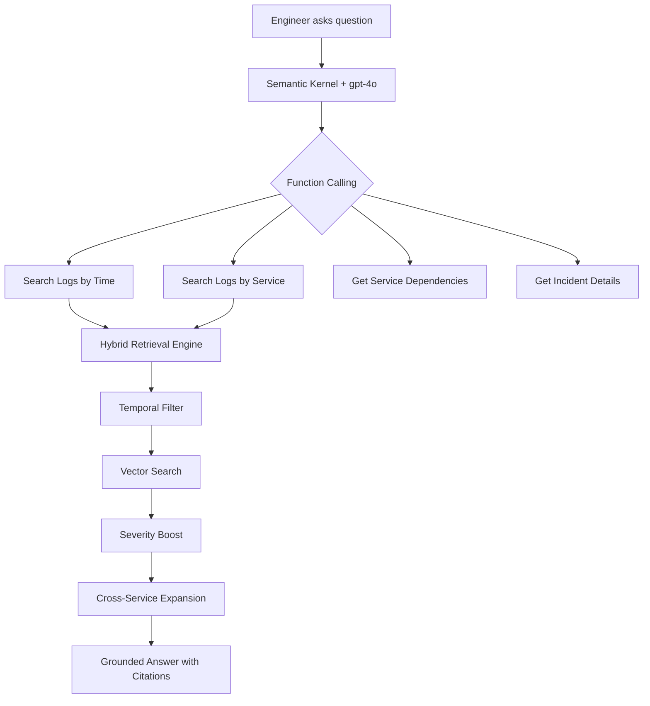

# Incident Investigation Copilot

An AI-powered production incident analysis tool that ingests multi-service logs, indexes them with temporal and semantic awareness, and answers investigative questions in natural language with cited evidence.

**Built with:** C# / ASP.NET Core, Azure Cosmos DB (Vector Search), Azure OpenAI, Semantic Kernel

## The Problem

Production incidents are stressful and time-consuming. Engineers jump between Grafana dashboards, scroll through thousands of log lines in Kibana, and mentally correlate events across services. The critical question, "what actually changed or broke?", often takes hours to answer because the data is scattered across tools and buried in noise.

Existing observability platforms (Datadog, Grafana, PagerDuty) have started adding AI features, but they operate within their own data silos. None of them let you have a conversation like: "Show me everything that changed in the payment service in the 10 minutes before the crash, and check if the upstream auth service had any anomalies at the same time."

## How It Works



### Architecture

```
API Layer (ASP.NET Core)
  POST /api/incidents/ingest      - Accepts structured log batches
  POST /api/incidents/investigate  - Natural language investigation
  POST /api/search                - Hybrid semantic search
  POST /api/search/compare        - Compare hybrid vs naive retrieval
  GET  /api/services/graph        - Service dependency graph
  GET  /api/incidents             - List incidents
  POST /api/seed                  - Populate with sample data

Ingestion Pipeline
  Log Normalizer -> Temporal Chunker -> Embedding Generator -> Cosmos DB

Retrieval Engine (3-stage hybrid)
  1. Temporal Filter    - Narrow to relevant time window
  2. Vector Search      - Find semantically similar chunks
  3. Severity Boost     - Prioritize ERROR/FATAL over INFO/DEBUG
  + Cross-service expansion via dependency graph

AI Layer (Semantic Kernel)
  - gpt-4o with function calling
  - Conversation memory in Cosmos DB
  - Grounded responses with log chunk citations
```

## Key Design Decisions

### Why temporal chunking instead of fixed-size chunking?

Standard RAG tutorials split text into fixed 500-token chunks. This is terrible for log data because it splits related events across chunks and loses temporal context. Temporal chunking groups logs into 5-minute windows per service, preserving the chronological sequence that is critical for root cause analysis. A chunk's embedding captures the "semantic fingerprint" of what happened during that window.

### Why Cosmos DB over Postgres + pgvector?

The project needs a single database for operational data (log chunks, service graphs, conversation history) AND vector search. Running two databases for a tool that is supposed to simplify operations felt ironic. Cosmos DB handles both with its built-in DiskANN vector index, and the free tier (1000 RU/s, 25 GB) makes it practical for a portfolio project while demonstrating a production-viable architecture.

### Why Semantic Kernel over LangChain?

Semantic Kernel is Microsoft's official SDK for building AI agents in C#. It has first-class support for Azure OpenAI, integrates with the .NET dependency injection system, and is what Microsoft teams actually use. Since this project targets a Microsoft SWE role, using their own framework demonstrates ecosystem alignment.

### Why hybrid retrieval matters

Pure vector search has a critical flaw for log data: it finds semantically similar logs but ignores time. If your database has logs from 100 different incidents, a query about "payment failure" might return logs from last month instead of tonight. The three-stage pipeline (temporal filter, vector search, severity boost) plus cross-service correlation consistently outperforms naive vector search for incident investigation queries.

## Sample Investigation

The project includes a realistic cascading payment failure scenario across four microservices:

**The Incident:** A slow database query causes connection pool exhaustion in PostgresDB. This cascades to AuthService (timeouts), then PaymentService (circuit breaker opens), and finally APIGateway (failover to backup region).

**Sample Query:**

```bash
curl -X POST http://localhost:5152/api/incidents/investigate \
  -H "Content-Type: application/json" \
  -d '{"question": "What caused the payment failures around 3:12am?"}'
```

**Sample Response (abbreviated):**

> The payment failures at 3:12am were caused by a cascading failure originating from PostgresDB. At 3:05am, connection pool utilization hit 85% due to a slow query from orders-service v2.3.1. By 3:07am, the pool was fully exhausted. This caused AuthService to timeout at 3:08am, which triggered PaymentService's circuit breaker at 3:12am. The root cause was the slow ORDER BY query consuming multiple connections simultaneously.

## Getting Started

### Prerequisites

- .NET 8 SDK
- Azure account (free tier works)
- Azure Cosmos DB account with vector search enabled
- Azure OpenAI resource with gpt-4o and text-embedding-3-small deployed

### Setup

1. Clone the repository:

```bash
git clone https://github.com/tanmaysalunke/incident-copilot.git
cd incident-copilot
```

2. Create `appsettings.Development.json` with your Azure credentials:

```json
{
  "CosmosDb": {
    "Endpoint": "your-cosmos-endpoint",
    "Key": "your-cosmos-key"
  },
  "AzureOpenAI": {
    "Endpoint": "your-openai-endpoint",
    "ApiKey": "your-openai-key"
  }
}
```

3. Enable vector search on your Cosmos DB account:

```bash
az cosmosdb update --name your-account --resource-group your-rg --capabilities EnableNoSQLVectorSearch
```

4. Build and run:

```bash
dotnet build
dotnet run
```

5. Seed sample data:

```bash
curl -X POST http://localhost:5152/api/seed
```

6. Start investigating:

```bash
curl -X POST http://localhost:5152/api/incidents/investigate \
  -H "Content-Type: application/json" \
  -d '{"question": "What caused the payment failures around 3:12am?"}'
```

## API Reference

| Endpoint | Method | Description |
|----------|--------|-------------|
| `/api/health` | GET | Health check with endpoint listing |
| `/api/incidents/ingest` | POST | Ingest structured log batches |
| `/api/incidents/investigate` | POST | AI-powered natural language investigation |
| `/api/incidents` | GET | List all incidents |
| `/api/search` | POST | Hybrid semantic search |
| `/api/search/compare` | POST | Compare hybrid vs naive retrieval |
| `/api/services/graph` | GET | Service dependency graph |
| `/api/seed` | POST | Populate with sample incident data |

## Tech Stack

| Component | Technology |
|-----------|-----------|
| Language | C# 12 / .NET 8 |
| Web Framework | ASP.NET Core Minimal APIs |
| AI Orchestration | Semantic Kernel |
| Database | Azure Cosmos DB for NoSQL (with DiskANN vector search) |
| Embeddings | Azure OpenAI text-embedding-3-small |
| Chat Model | Azure OpenAI gpt-4o |
| Logging | Serilog (structured JSON) |
